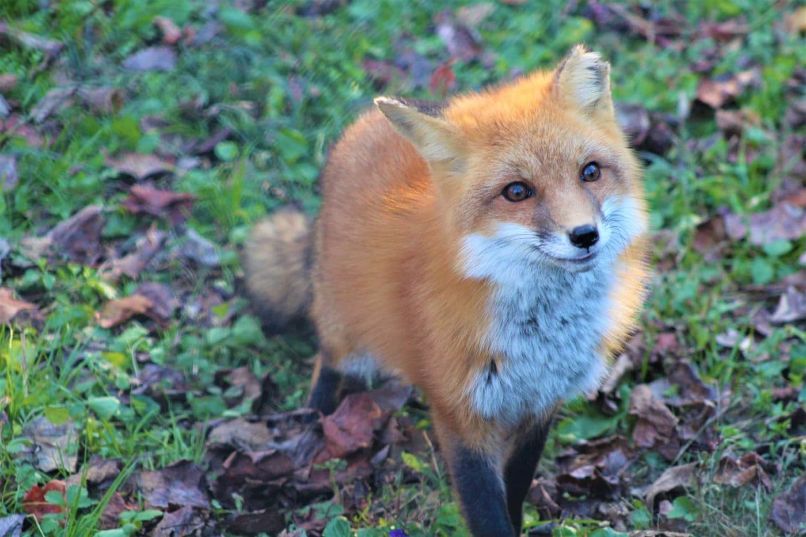

# random_fourier_features

based upon https://arxiv.org/abs/2006.10739
 

The picture above is the target image that a mlp is tasked with to generate.  
The mlp takes xy coordinates and generates rgb values.

  default mlp 

  random fourier features
